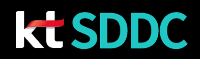

# SDDC 의 이해

<figure><figcaption></figcaption></figure>

SDDC 내용 SDDC 내용 SDDC 내용 SDDC 내용 SDDC 내용 SDDC 내용 SDDC 내용 SDDC 내용 SDDC 내용 SDDC 내용 SDDC 내용 SDDC 내용 SDDC 내용\
SDDC 설명 SDDC 설명 SDDC 설명 SDDC 설명 SDDC 설명 SDDC 설명 SDDC 설명 SDDC 설명 SDDC 설명 SDDC 설명 SDDC 설명 SDDC 설명 SDDC 설명 SDDC 설명 SDDC 설명 SDDC 설명 SDDC 설명 SDDC 설명

내용 수정

## 용어 이해

SDDC 에서 사용하는 용어를 정리한 문서로 이동하기


[project.md](kt-cloud/readme/project.md)



[vpc.md](kt-cloud/readme/vpc.md)



[subnet.md](kt-cloud/readme/subnet.md)



**Good to know:** Using the 'Page Link' block lets you link directly to a page. If this page's name, URL or parent location changes, the reference will be kept up to date. You can also mention a page – like [vpc.md](kt-cloud/readme/vpc.md "mention") – if you don't want a block-level link.

