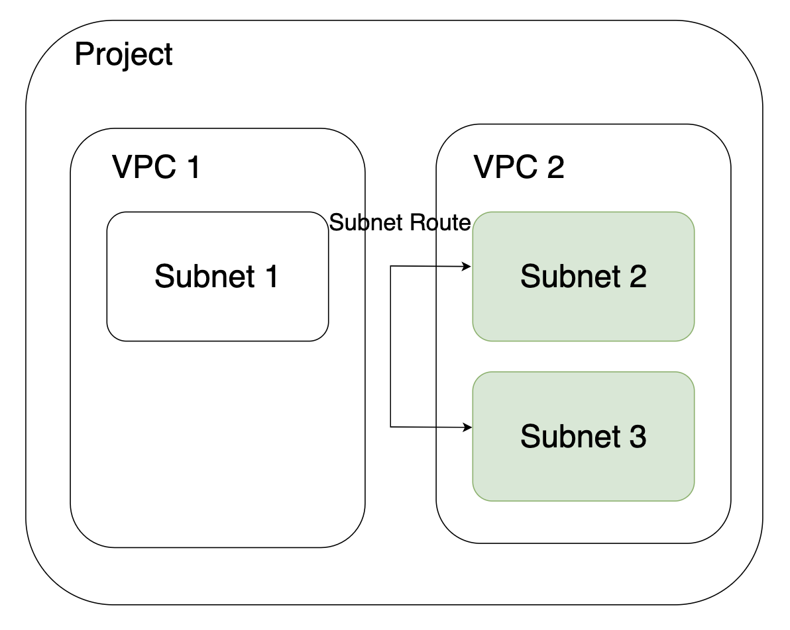

# Subnet

### 개요

VM(Server)이 외부와 통신하기 위해 사용하는 VPC 내의 세분화된 Network 격리 공간입니다.\
VPC 별 최대 3 개의 Subnet을 생성할 수 있으며, \
VPC 내에서 Subnet Route를 통해 다른 Subnet과 통신이 가능합니다.

## 이미지

<figure><figcaption></figcaption></figure>
