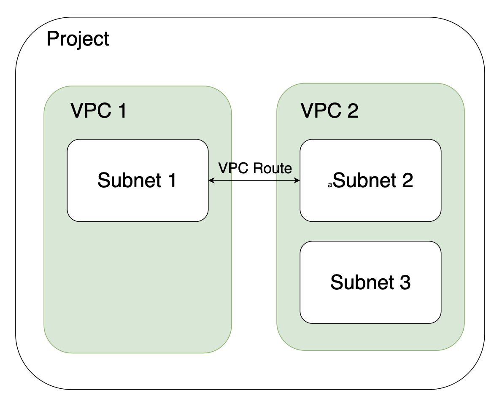

# VPC

### 개요

SDDC Project 하위 네트워크 격리 단위로 Virtual Private Cloud를 의미합니다. \
프로젝트 별 최대 3개의 VPC를 생성할 수 있으며, VPC Address Range 는 겹칠 수 없습니다.\
VPC Route을 통해 다른 서로 다른 VPC 내 Subnet 끼리 통신할 수 있습니다.

## 이미지

<figure><figcaption></figcaption></figure>
