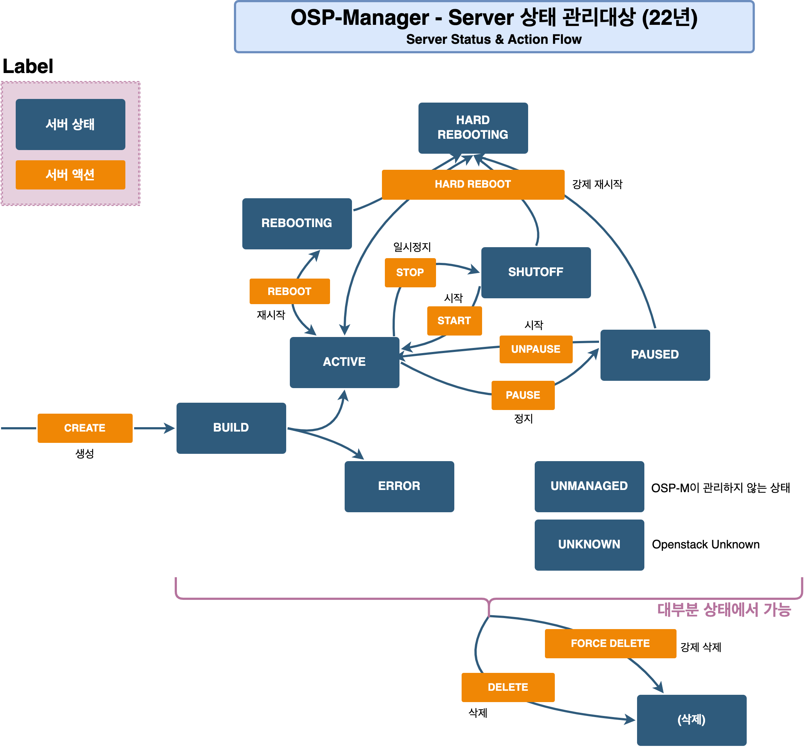

# Server

### 개요

CPU, 메모리 등의 리소스를 할당 받아 Application을 동작할 수 있는 가상머신(VM)을 의미합니다.\
네트워크 기능을 통해 다른 VM 또는 외부와 통신할 수 있습니다.

### Server Action Flow

<figure><figcaption></figcaption></figure>

### Server Status

| Server Status | Server Action                                                           | 비고      |
| ------------- | ----------------------------------------------------------------------- | ------- |
| BUILD         | 
DELETE FORDE_DELETE
                                           | 진행중인 상태 |
| ERROR         | 
DELETE FORCE_DELETE
                                           | 진행중인 상태 |
| ACTIVE        | 
REBOOT HARD_REBOOT STOP PAUSE DELETE FORCE_DELETE
 |         |
| SHUTOFF       | 
START HARD_REBOOT DELETE FORCE_DELETE
                   |         |
