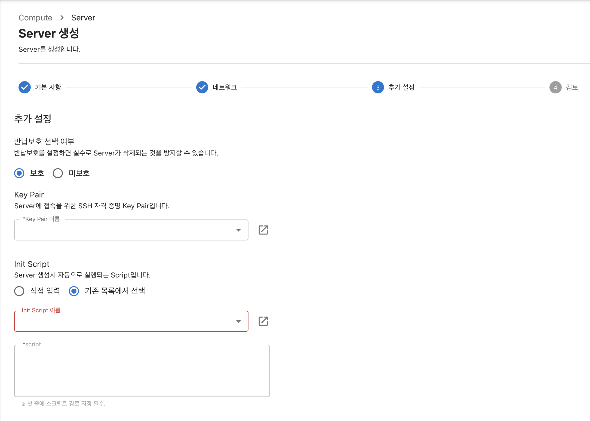

# InitScript

### 개요

Server를 생성 후 초기 설정에 대한 명령어를 저장한 Script 파일입니다.\
Server 생성 시 반드시 등록해야합니다.

### 예시 화면

<figure><figcaption></figcaption></figure>

### 예시 코드

```
#!/bin/bash
echo "1234" | passwd --stdin root
```
